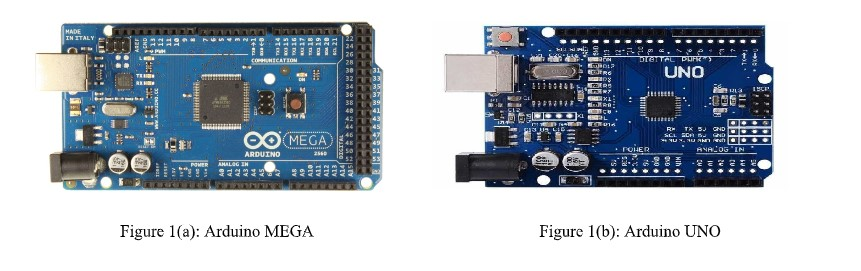
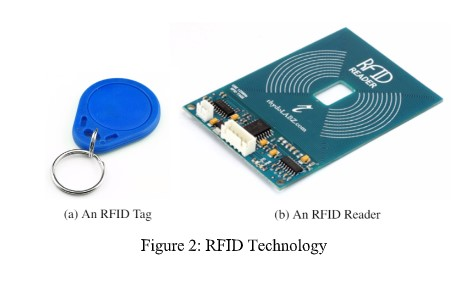
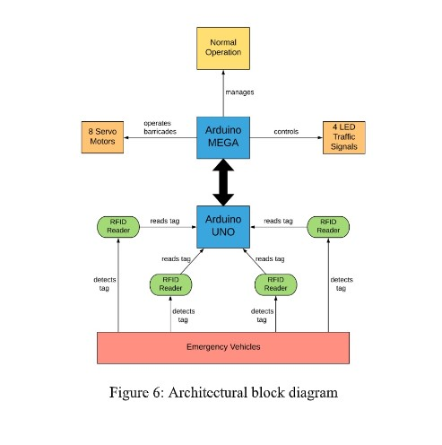
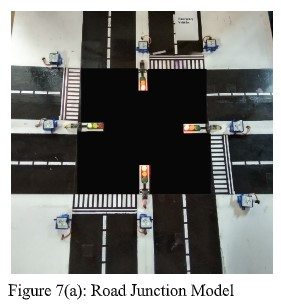
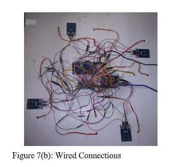

# AmbulanceTrafficManagemant
Automatic signal and barricades management system for Ambulances based on Arduino Mega,Arduino Uno,&lt;FRC522 RFID's,Servo motors and LED's.

traff4gm.ino : Arduino Mega code.

unotraff.ino : Arduino Uno system.

Requirements : 12 LED's for Signals, 8 Servo motors for barricades, 4 RFID readers for Ambulance Detection.1 arduino uno,1 arduino mega.

